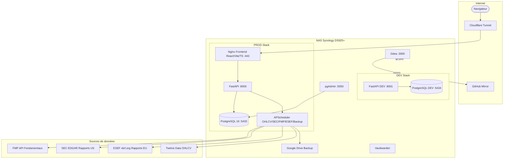

[](https://git.sauhabah-advisory.eu/asauhabah/ethical-finance/actions)
[](https://git.sauhabah-advisory.eu/asauhabah/ethical-finance/actions)
[](https://www.synology.com)
[](https://docker.com)
[](https://fastapi.tiangolo.com)
[](https://vitejs.dev)
[](https://postgresql.org)
[](https://cloudflare.com)
[](http://192.168.1.47:9000/dashboard?id=ethical-finance)

# ☪️ Sauhabah Ethical Finance — Plateforme d'analyse quantitative

> Plateforme d'investissement islamique et éthique auto-hébergée, combinant backtesting event-driven, signaux ML/sentiment/fondamentaux, screening Finance Islamique AAOIFI, suivi de portefeuille en temps réel et analyse technique avancée. Gratuite, transparente, auto-critique.

🔗 **Live** : [app.sauhabah-advisory.eu](https://app.sauhabah-advisory.eu)
🔗 **API** : [api.sauhabah-advisory.eu/docs](https://api.sauhabah-advisory.eu/docs)
🔗 **Gitea** : [git.sauhabah-advisory.eu](https://git.sauhabah-advisory.eu/asauhabah/ethical-finance)
📦 **Mirror GitHub** : [github.com/AzipSauhabah/ethical-finance](https://github.com/AzipSauhabah/ethical-finance)

---

## Architecture



---

## État de la base (juin 2026)

| Métrique | Valeur |
|---|---|
| Barres OHLCV | 3.57M (depuis 2000) |
| Tickers | 626 (SP500 + CAC40 + ETF) |
| Fondamentaux | 626 enregistrements SEC EDGAR |
| Dividendes | 49 581 |
| Splits | 1 550 |
| IV tickers | 490 |
| Dernière MAJ OHLCV | 2026-06-04 |
| Stratégies actives | 10 (signaux 20h30 UTC) |
| Tests | 195/195 ✅ |

---

## Fonctionnalités

### Finance Islamique (AAOIFI)
- Screening 4 critères : activité haram, ratio dettes/MC, ratio revenus haram, ratio trésorerie
- CAC40 : 35/35 tickers screenés · SP500 : 576/576
- Proxy SEC EDGAR pour l'`interest_bearing_debt` quand les segments ne sont pas disponibles
- Badge ✓/✗ dans Portfolio et Screener
- Section dédiée dans le PDF tearsheet
- APScheduler ESEF tous les lundis 04h UTC

### Backtesting event-driven
- Moteur strict sans look-ahead bias
- 10 stratégies plug-and-play via `@strategy_registry.register` :
  BuyHold, EqualWeight, Momentum, MeanReversion, SMACrossover,
  RiskParity, MinVariance, DualMomentum, AdaptiveTrend, MLEnsemble (EPR5)
- Coûts réalistes 6 composantes : commission, slippage, TTF, stamp duty, spread FX, impact marché
- Dividendes réinvestis (toggle adj_close/close)
- Fractions par broker (Revolut)
- Monte Carlo — 1 000 simulations NAV

### EPR5 — Moteur ML hybride
- RandomForest + LSTM TensorFlow (score 60/40)
- 5 signaux : technique RSI/MACD/BB, fondamental Magic Formula, sentiment VADER, momentum, ML
- ATR stops + trailing stops + ATR-based position sizing

### Screener
- Filtres : ESG, Finance Islamique, Buffett Score, secteur, univers
- Buffett Score 0-100 : ROE / dette nette / FCF yield / marge nette
- Panel détail par ticker : critères AAOIFI + Buffett

### Portfolio
- Dashboard temps réel via Twelve Data WebSocket (badge "15min")
- Positions réelles (Qté/PRU) — persistance via `device_id` anonyme (sans login)
- P&L global + par position
- Analytics : Sharpe, Sortino, volatilité, max drawdown, corrélations, efficient frontier
- Finance Islamique panel par ticker

### Analyse technique
- Indicateurs : RSI, Bollinger, MACD, Fibonacci, EMA
- Elliott Wave — ZigZag + vagues 1-5 + validation
- Intraday 1h WebSocket + sparklines

### PDF Tearsheet
- 15+ pages : cover, métriques, signaux, stress tests, rolling Sharpe/vol, positions, trades, Finance Islamique, Buffett Score
- Export via `POST /api/backtest/pdf`

### Infrastructure
- Gitea self-hosted — source de vérité (origin NAS → Gitea)
- GitHub mirror automatique pour visibilité recruteurs
- Gitea Actions : tests + ruff/black auto-fix + SonarQube 9.9
- pgAdmin sur :5050
- Vaultwarden
- Backup PostgreSQL quotidien vers Google Drive
- Patch OHLCV quotidien via `POST /api/admin/drive-patch`

---

## Stack technique

| Composant | Technologie |
|---|---|
| Backend | FastAPI (Python 3.11), SQLAlchemy, APScheduler |
| Frontend | React 18 / Vite / TypeScript |
| Base de données | PostgreSQL 16 |
| ML | scikit-learn, TensorFlow, VADER |
| Hébergement | Synology DS925+ (4 Go RAM) |
| Tunnel | Cloudflare Tunnel |
| CI/CD | Gitea Actions |
| Qualité code | SonarQube 9.9 (local, 0 CRITICAL/MAJOR) |
| Tests | pytest — 195 tests |

---

## Déploiement NAS

```bash
# Workflow standard (sans rebuild)
cd /volume1/docker/ethical-finance
/volume1/docker/bin/git pull          # depuis Gitea (source de vérité)
sudo docker cp backend/module.py ethical-finance-api:/app/backend/module.py
sudo docker restart ethical-finance-api

# Build frontend
sudo docker run --rm \
  -v /volume1/docker/ethical-finance:/app \
  -w /app/frontend \
  -e VITE_API_URL=https://api.sauhabah-advisory.eu \
  node:20-alpine sh -c "npm install && npm run build"

# Rebuild complet (nouveau pip package seulement)
sudo docker-compose up -d --build
```

**Ports PROD :** DB 5433 · API 8000
**Ports DEV :** DB 5434 · API 8001 (`/volume1/docker/ethical-finance-dev`)

⚠️ Ne jamais exposer le port 5432 (conflit PostgreSQL natif DSM).
⚠️ Toujours valider en DEV avant tout changement en PROD.
⚠️ `chmod 755 ~` ne survit pas au reboot — réappliquer si clé SSH perdue.
⚠️ Ne jamais `git clean -fd` (détruit `postgres/` et `data/`).

---

## Sources de données

| Source | Usage | Scheduler |
|---|---|---|
| Twelve Data | OHLCV daily + intraday 1h | Daily 20h UTC |
| FMP | Fondamentaux (revenus, dettes, FCF) | Weekly |
| SEC EDGAR | Rapports 10-K/10-Q US | Lundi 04h UTC |
| ESEF xbrl.org | Rapports IFRS Europe | Lundi 04h UTC |
| Google Drive | Patch OHLCV quotidien | `POST /api/admin/drive-patch` |

---

## Roadmap

### Livré (v2.6 — 05/06/2026)
- [x] Finance Islamique AAOIFI — CAC40 + SP500
- [x] Buffett Score — Portfolio + Screener + PDF
- [x] Auth JWT supprimée → `device_id` anonyme (Portfolio)
- [x] Patch OHLCV quotidien depuis Google Drive
- [x] 195 tests — 0 échec
- [x] Endpoints dupliqués nettoyés (`/api/stats`)
- [x] SSH NAS via clé ed25519 (MCP Claude Desktop)
- [x] Origin NAS → Gitea (source de vérité)
- [x] Repo nettoyé (fichiers parasites `EOF`, `else:`, `import`, `tsc`)

### À venir
- [ ] TrackerPage — migrer auth JWT → `device_id`
- [ ] Backfill SP500 restants (`interest_bearing_debt`)
- [ ] `macro_series` INSEE BDM + `insider_signals` AMF
- [ ] Détection anomalies fondamentaux
- [ ] RAM 16 Go NAS (attente baisse prix)
- [ ] Ollama LLM local (bloqué par RAM)

---

## Comparaison QuantConnect

| Axe | Ethical Finance | QuantConnect |
|---|---|---|
| **Transparence** | Code source complet, chaque hypothèse visible | Boîte noire cloud |
| **Screening islamique** | Natif AAOIFI 4 critères | Absent |
| **Coûts français** | TTF, PEA, Fortuneo/Degiro grilles réelles | Calibré marché US |
| **ML hybride** | EPR5 : LSTM + Magic Formula + Sharia | Séparé |
| **Stratégies** | `@register` → auto GUI + API | Configuration lourde |
| **Hébergement** | Self-hosted NAS, 0€/mois | Cloud payant |

---

## Avertissement

Cette application est un outil d'analyse personnel à but éducatif. Elle ne constitue pas un conseil en investissement au sens de la réglementation AMF. Les performances passées ne présagent pas des performances futures.

---

## Auteur

**Azip Sauhabah** · GitHub : [AzipSauhabah](https://github.com/AzipSauhabah)

## Licence

GNU General Public License v3.0
